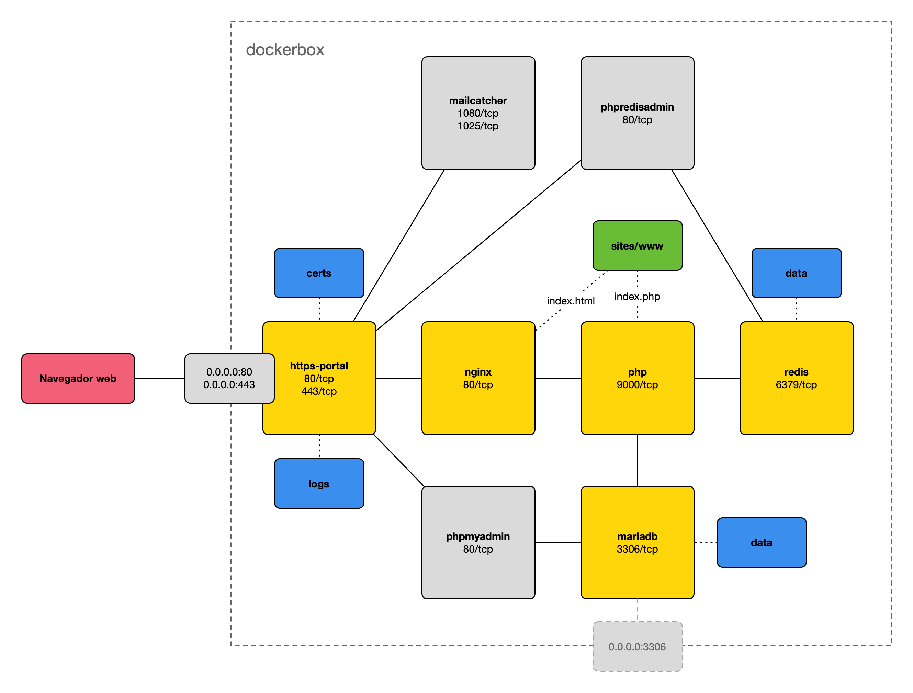

# dockerbox

Entorno de desarrollo para programación web con PHP en Docker.

## Instalación

1. Instalar Docker para [Windows y macOS](https://www.docker.com/products/docker-desktop)
   o [Ubuntu](https://docs.docker.com/install/linux/docker-ce/ubuntu/).

   > En Windows y macOS, para evitar errores de credenciales al descargar contenedores, hay
   > que registrarse en [Docker Hub](https://hub.docker.com) e iniciar sesión con esa cuenta
   > en Docker Desktop.

2. En Windows, instalar [Scoop](https://scoop.sh) usando PowerShell:

   ```powershell
   [Net.ServicePointManager]::SecurityProtocol = [Net.SecurityProtocolType]::Tls12
   Invoke-Expression (New-Object System.Net.WebClient).DownloadString('https://get.scoop.sh')
   ```

   Y después instalar los comandos necesarios:

   ```powershell
   scoop install git make
   ```

3. Editar como root el fichero `/etc/hosts` (en macOS y Linux) o
   en [Windows](https://www.adslzone.net/esenciales/windows-10/editar-archivo-host/) y añadir:

   ```text
   127.0.0.1	dockerbox.test
   127.0.0.1	phpmyadmin.dockerbox.test
   127.0.0.1	phpredisadmin.dockerbox.test
   127.0.0.1	mailcatcher.dockerbox.test
   ```

   > En macOS y Windows se puede [modificar la resolución de DNS](https://github.com/ijaureguialzo/automatic-test-domains)
   > para que todos los dominios `.test` se redirijan automáticamente a `localhost` y no tener que editar a mano
   > el fichero `/etc/hosts`.

4. Clonar este repositorio:

   ```shell
   git clone https://github.com/ijaureguialzo/dockerbox.git
   ```

5. En un terminal, situarse en la carpeta `dockerbox` (o si se ha renombrado, la que contenga este archivo `README.md`):

   ```shell
   cd dockerbox
   ```

6. Copiar el fichero `env-example` a `.env`:

   En macOS y Linux:

   ```shell
   cp env-example .env
   ```

   En Windows:

   ```shell
   copy env-example .env
   ```

   > :warning: Es recomendable cambiar las contraseñas por defecto.

7. Arrancar los servicios:

   ```shell
   make start
   ```

   > :warning: La primera vez tardará varios minutos en crear los contenedores y unos 30 segundos en generar los
   > certificados digitales; la web dará error hasta que termine.

## Servicios

- [Sitio web](https://dockerbox.test)
- [phpMyAdmin](https://phpmyadmin.dockerbox.test)
- [phpRedisAdmin](https://phpredisadmin.dockerbox.test)
- [MailCatcher](https://mailcatcher.dockerbox.test)

## Utilidades

- Acceso mediante shell al contenedor de php:

  ```shell
  make workspace
  ```

- Actualizar los contenedores:

  ```shell
  make update
  ```

## (Opcional) Añadir un nuevo sitio web

1. Crear una nueva carpeta `sites/nuevo_sitio` con el contenido del nuevo sitio web.

   > El script de arranque busca carpetas dentro del directorio `sites` y las publica en el servidor web:
   > - Si encuentra un subdirectorio `nuevo_sitio/public` o `nuevo_sitio/laravel/public`, usará esa carpeta como raíz del sitio web.
   > - Si no, publicará la carpeta `nuevo_sitio` directamente.

   > Independientemente de si hay carpeta `public` o no, el nuevo sitio siempre se llamará `nuevo_sitio.dockerbox.test`.

2. Editar como root el fichero `/etc/hosts` (en macOS y Linux) o
   en [Windows](https://www.adslzone.net/esenciales/windows-10/editar-archivo-host/) y añadir una nueva línea:

   ```text
   127.0.0.1    nuevo_sitio.dockerbox.test
   ```

3. Recargar los contenedores web:

    ```bash
    make reload
    ```

4. Acceder al [nuevo sitio](https://nuevo_sitio.dockerbox.test).

## (Opcional) Depurar con Xdebug y PhpStorm

1. Modificar el fichero `.env` añadiendo la dirección IP del ordenador en la variable `XDEBUG_REMOTE_HOST`.
2. Habilitar la escucha de conexiones de depuración en PhpStorm haciendo click en el
   icono: 
3. Fijar un _breakpoint_ y cargar la página en el navegador.

## (Opcional) Habilitar el puerto de MariaDB en localhost

En vez de arrancar los contenedores con `start` usar `start-expose-mariadb`:

```shell
make start-expose-mariadb
```

## Estructura de dockerbox


